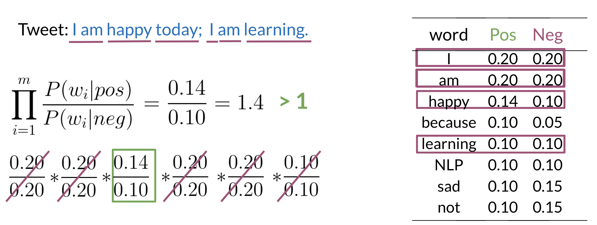

# Navie Bayes
Naive Bayes Introduction

To build a classifier, we will first start by creating conditional probabilities given the following table:

This allows us compute the following table of probabilities:

Once you have the probabilities, you can compute the likelihood score as follows

A score greater than 1 indicates that the class is positive, otherwise it is negative.